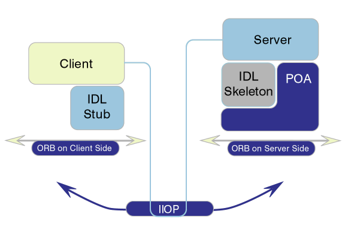

# Thrift Demo项目介绍

本项目主要是用来演示Thrift的简单使用

## Thrift介绍

Apache Thrift是一个有facebook开源的简单RPC框架,2007年facebook提交到Apache基金会将Thrift作为一个开源项目，现在是一个Apache的顶级项目。


根据Apache Thrift的官方描述，Thrift是一个：

> software framework, for scalable cross-language services developement, combines a software stack with a code generation engine to build services that work efficiently and seamlessly between C++, Java, Python, PHP, Ruby, Erlang, Perl, Haskell, C#, Cocoa, Javascript, Nodej.js, Smalltalk, OCaml and Delphi and other languages.

当时facebook创造thrift是为了解决facebook系统中各个系统之间大数据量的传输通信以及系统之间语言环境不同需要跨平台的特性。

Thrift适用于搭建大型书籍交换及存储的通用工具，对于大型系统中的内部数据传输对于JSON和XML来说，无论是性能、传输大小上都有明显的优势。

## Thrift的基本工作方式

Thrift允许通过一个跨语言的定义文件的方式定义数据类型和服务接口，这个文件作为RPC客户端和服务器通信的标准，你可以去看看Thrift的白皮书了解更多的信息。


## Thrift安装

### Linux

```
apt-get install thrift
```

### Mac OSX

```
brew install thrift
```
### Windows

下载一个官方编译的安装包，安装就好了。

## Thrift IDL

Thrift是IDL(interface definition language)描述性语言的一个具体实现，关于IDL的话题，我们可以追溯到CORBA(Common Object Request Broker Architecture/公用对象请求代理体系结构)盛行的1999-2001年，在IDL中我们似乎不会忘记这几个关键字：module、interface、String、long和int，我还记得IDL利用module来创建名称空间，并且准确的映射为Java的package，这些特性几乎和现在的thrift的特性完全相同，所以thrift的设计思路和理念并不是什么从火星来的new idea，看看在那个CORBA盛行的年度人们提出来的概念,CORBA请求的各个部分，和之前我们那个Thrift图是否很相似。



## Thrift基础架构

Thrift是一个服务端和客户端的架构体系，从我个人的观感上看Thrift是一个类似XML-RPC+Java-to-IDL+Serialization Tools=Thrift的东东。Thrift具有自己内部定义的传输协议规范（TProtocol）和传输数据标准（TTransports），通过IDL脚本对传输数据的数据结构（struct）和传输数据的业务逻辑（service）根据不同的运行环境快速构建相应的代码，并通过自己内部序列化机制对传输的数据进行简化和压缩提高并发、大型系统中数据交互的成本。


我们从下面的图中那个可以看到Thrift的整体架构分为6个部分：

1. 你的业务逻辑实现（Your Code）
2. 客户端和服务端对应的Service
3. 执行读写操作的计算结果
4. TProtocol
5. TTransports
6. 底层I/O通信


我们看图中前面三个是：

1. 你通过Thrift脚本文件生成的代码
2. 图中褐色部分是你根据生成代码构建的客户端和服务器的代码
3. 红色的部分是两端产生的技术结果。

从TProtocol下面的三个部分是Thrift的传输体系和传输协议以及底层I/O通信。

Thrift并且提供阻塞、非阻塞，单线程、多线程的模式运行在服务器上，还可以配合服务器/容器一起运行，可以和现有的Java服务器/Web容器无缝的结合。

## 数据类型

* Base Types： 基本类型
* Struct： 结构体类型
* Container: 容器类型，即List、Set、Map等
* Exception： 异常类型
* Service：定义对象的接口和一系列方法
* 
## 协议

Thrift可以让你选择客户端与服务器之间的传输通信协议的类别，在传输协议上总体上划分为文本（text）和二进制（binary）传输协议，为节省带宽，提供传输效率，一般情况下使用二进制类型的传输协议为多数，但有时候还是会使用基于文本类型的协议，这些需要根据项目/产品中的实际需求：

1. TBinaryProtocol： 二进制编码格式进行数据传输
2. TCompactProtocol： 这种协议非常有效，使用Variable-Length Quantity(VLQ)编码对书籍进行压缩。
3. TJSONProtocol： 使用JSON的数据编码进行数据传输。
4. TSimpleJSONProtocol： 这种协议只提供JSON只写的协议，适用于通过脚本语言解析。
5. TDebugProtocol： 在开发的过程中帮助开发人员调试使用，以文本的形式展现方便阅读。

## 传输层

1. TSocket： 使用阻塞式I/O进行传输，也是最常见的模式
2. TFramedTransport： 使用非阻塞方式，按块的大小进行传输，类似于Java中的NIO。
3. TFileTransport： 顾名思义按照文件的方式进行传输，虽然这种方式不提供Java的实现，但是实现起来非常简单。
4. TmemoryTransport： 使用内存I/O，就好比Java中的ByteArrayOuputStream实现。
5. TZibTransport： 使用只写zlib压缩，不提供Java的实现。

## 服务端类型

1. TSimpleServer： 单线程服务器端使用的标准的阻塞式I/O
2. TThreadPoolServer: 多线程服务器端使用标准的阻塞式I/O。
3. TNonblockingServer： 多线程服务器端使用的非阻塞式I/O，并实现了Java中的NIO通道。

# Maven整合Thrift

## libthrift依赖

```xml
<properties>
    <libthrift.version>0.9.2</libthrift.version>
</properties>

<dependency>
    <groupId>org.apache.thrift</groupId>
    <artifactId>libthrift</artifactId>
    <version>${libthrift.version}</version>
       <exclusions>
            <exclusion>
                <groupId>commons-logging</groupId>
                <artifactId>commons-logging</artifactId>
            </exclusion>
        </exclusions>
 </dependency>
```

## maven基于antrun插件将thrift IDL文件自动生成代码

### 添加profile

```xml
<profiles>
        <profile>
            <id>profile-buildthrift</id>
            <activation>
                <file> <exists>/usr/local/bin/thrift</exists> </file>
            </activation>
            <build>
                <plugins>
                    <plugin>
                        <artifactId>maven-antrun-plugin</artifactId>
                        <version>1.7</version>
                        <executions>
                            <execution>
                                <id>generate-sources</id>
                                <phase>generate-sources</phase>
                                <configuration>
                                    <target>
                                        <ant antfile="${project.basedir}/build.xml">
                                            <target name="thrift"/>
                                        </ant>
                                    </target>
                                </configuration>
                                <goals> <goal>run</goal> </goals>
                            </execution>
                        </executions>
                    </plugin>
                </plugins>
            </build>
        </profile>
    </profiles>
```

### 添加build.xml文件

```xml
<?xml version="1.0" encoding="UTF-8"?>

<project name="thrift-demo" default="thrift" basedir="../thrift-demo">

    <description>
        Generate code from thrift files
    </description>

    <property name="thrift.command" value="/usr/local/bin/thrift"/>

    <property name="gen-source.basedir" value="target/generated-sources"/>
    <property name="java.srcdir"        value="src/main/java"/>
    <property name="thrift.srcdir"      value="src/main/thrift"/>
    <property name="target.srcdir" value="com/github/tonydeng/demo/thrift/api" />

    <target name="init-taskdefs">
        <taskdef resource="net/sf/antcontrib/antcontrib.properties" classpath="${ant-contrib:ant-contrib:jar}"/>
    </target>

    <target name="init">
        <!-- good for debugging -->
        <!--<echoproperties/>-->

        <!-- prep dirs -->
        <mkdir dir="${gen-source.basedir}" />
        <delete>
            <fileset dir="${gen-source.basedir}" includes="**/*"/>
        </delete>
    </target>

    <target name="gen-thrift">
        <mkdir dir="${gen-source.basedir}"/>
        <exec executable="${thrift.command}">
            <arg value="--gen" />
            <arg value="java:beans"/>
            <arg value="-o"/>
            <arg value="${gen-source.basedir}"/>
            <arg value="${thrift.srcdir}/thrift-demo.thrift"/>
        </exec>
    </target>

    <target name="post-process">
        <!-- move java sources into place -->
        <delete>
            <fileset dir="${java.srcdir}" includes="${target.srcdir}/*"/>
        </delete>
        <echo>srcdir is ${java.srcdir}/${target.srcdir}</echo>
        <mkdir dir="${java.srcdir}/${target.srcdir}"/>
        <copy todir="${java.srcdir}/${target.srcdir}">
            <fileset dir="${gen-source.basedir}/gen-javabean/${target.srcdir}" includes="**/*"/>
        </copy>
    </target>

    <target name="thrift" depends="init-taskdefs, init, gen-thrift, post-process"/>
</project>
```

## maven测试方式

### 启动Thrift服务
```
mvn clean compile exec:java -Dexec.mainClass="com.github.tonydeng.demo.thrift.server.ThriftServer" -T20
```

### 使用Thrift客户端调用服务

```
mvn test -Dtest=AdditionClientTest -T20
```